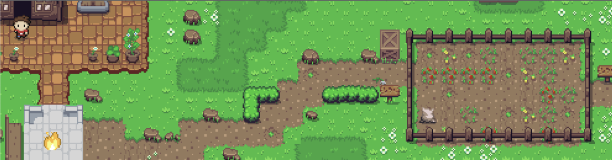

# React Advanced London 2022 | Workshop

[](./LICENSE)
[![Powered by Modus_Create](https://img.shields.io/badge/powered_by-Modus_Create-blue.svg?longCache=true&style=flat&logo=data:image/svg+xml;base64,PHN2ZyB2aWV3Qm94PSIwIDAgMzIwIDMwMSIgeG1sbnM9Imh0dHA6Ly93d3cudzMub3JnLzIwMDAvc3ZnIj4KICA8cGF0aCBkPSJNOTguODI0IDE0OS40OThjMCAxMi41Ny0yLjM1NiAyNC41ODItNi42MzcgMzUuNjM3LTQ5LjEtMjQuODEtODIuNzc1LTc1LjY5Mi04Mi43NzUtMTM0LjQ2IDAtMTcuNzgyIDMuMDkxLTM0LjgzOCA4Ljc0OS01MC42NzVhMTQ5LjUzNSAxNDkuNTM1IDAgMCAxIDQxLjEyNCAxMS4wNDYgMTA3Ljg3NyAxMDcuODc3IDAgMCAwLTcuNTIgMzkuNjI4YzAgMzYuODQyIDE4LjQyMyA2OS4zNiA0Ni41NDQgODguOTAzLjMyNiAzLjI2NS41MTUgNi41Ny41MTUgOS45MjF6TTY3LjgyIDE1LjAxOGM0OS4xIDI0LjgxMSA4Mi43NjggNzUuNzExIDgyLjc2OCAxMzQuNDggMCA4My4xNjgtNjcuNDIgMTUwLjU4OC0xNTAuNTg4IDE1MC41ODh2LTQyLjM1M2M1OS43NzggMCAxMDguMjM1LTQ4LjQ1OSAxMDguMjM1LTEwOC4yMzUgMC0zNi44NS0xOC40My02OS4zOC00Ni41NjItODguOTI3YTk5Ljk0OSA5OS45NDkgMCAwIDEtLjQ5Ny05Ljg5NyA5OC41MTIgOTguNTEyIDAgMCAxIDYuNjQ0LTM1LjY1NnptMTU1LjI5MiAxODIuNzE4YzE3LjczNyAzNS41NTggNTQuNDUgNTkuOTk3IDk2Ljg4OCA1OS45OTd2NDIuMzUzYy02MS45NTUgMC0xMTUuMTYyLTM3LjQyLTEzOC4yOC05MC44ODZhMTU4LjgxMSAxNTguODExIDAgMCAwIDQxLjM5Mi0xMS40NjR6bS0xMC4yNi02My41ODlhOTguMjMyIDk4LjIzMiAwIDAgMS00My40MjggMTQuODg5QzE2OS42NTQgNzIuMjI0IDIyNy4zOSA4Ljk1IDMwMS44NDUuMDAzYzQuNzAxIDEzLjE1MiA3LjU5MyAyNy4xNiA4LjQ1IDQxLjcxNC01MC4xMzMgNC40Ni05MC40MzMgNDMuMDgtOTcuNDQzIDkyLjQzem01NC4yNzgtNjguMTA1YzEyLjc5NC04LjEyNyAyNy41NjctMTMuNDA3IDQzLjQ1Mi0xNC45MTEtLjI0NyA4Mi45NTctNjcuNTY3IDE1MC4xMzItMTUwLjU4MiAxNTAuMTMyLTIuODQ2IDAtNS42NzMtLjA4OC04LjQ4LS4yNDNhMTU5LjM3OCAxNTkuMzc4IDAgMCAwIDguMTk4LTQyLjExOGMuMDk0IDAgLjE4Ny4wMDguMjgyLjAwOCA1NC41NTcgMCA5OS42NjUtNDAuMzczIDEwNy4xMy05Mi44Njh6IiBmaWxsPSIjRkZGIiBmaWxsLXJ1bGU9ImV2ZW5vZGQiLz4KPC9zdmc+)](https://moduscreate.com)

## A Tale of Two Codebases



### Use the latest React features to clean up your code game… and our game code.
Anybody can write code that "works." But what makes the best engineers stand out is their ability to create solutions that are clear, concise, testable and easy to understand and maintain. Join us as we explore some of [React](https://reactjs.org/)’s most powerful tools for well-architected solutions by starting with a suboptimal game codebase and refactoring it using industry best practices such as [custom hooks](https://reactjs.org/docs/hooks-custom.html), [higher-order components](https://reactjs.org/docs/higher-order-components.html) (HOCs) and [contexts](https://reactjs.org/docs/context.html).

- [Getting Started](#getting-started)
- [How it Works](#how-it-works)
- [Developing](#developing)
  - [Prerequisites](#prerequisites)
  - [Testing](#testing)
  - [Contributing](#contributing)
- [Modus Create](#modus-create)
- [Licensing](#licensing)

# Getting Started

```sh
git clone https://github.com/ModusCreateOrg/react-london-2022.git
cd react-london-2022
npm i
npm start
```

# How it works

We've written a simple village game for your enjoyment, and we've written it BADLY.
Follow along during our workshop at [React Advanced London 2022](https://reactadvanced.com/)
to see how we use React best practices to make the code oh-so-GOOD.

## Agenda

1. **Introduction of the initial implementation and description of its issues.**<br>
   We glance over the initial state of the code and explain why the "but it works" approach is undesirable.
1. **Presentation of the tools available to improve the code base.**<br>
   List out custom hooks, HOC, context and a quick intro about them and what are the benefits of using them.
1. **The mindset behind architecting clean solutions and refactoring.**<br>
   How to think a few steps ahead and architect clean and maintainable solutions from the get-go.
1. **High level passthrough of the code and creation of the plan.**<br>
   We go over the actual code and create the plan of action.
1. **Extraction of code into utility functions.**<br>
   Find identical or similar code and create helper/utility functions, global or component-level.
1. **Extraction of state and effects into custom hooks.**<br>
   Find identical or similar states and effects and create global or component-level custom hooks.
1. **Grouping behavior into HOC.**<br>
   Extract common behaviors into HOCs.
1. **Creation of root level context and child components cleanup.**<br>
   Clean up communication between components by using a root level context.
1. **Result overview and discussion of possible future improvements.**<br>
   We take a step back and bask in the glory of our great work.
1. **How to keep your code clean, rules to follow and limitations to impose.**<br>
   A few notes on how to maintain control over your code.

# Developing

Open the code in your favorite IDE. Run the [setup script](#getting-started) above
to launch the app and keep it side-by-side on your screen with the code.

## Prerequisites

- Git ([Windows](https://git-scm.com/download/win)/[Mac](https://git-scm.com/download/mac)/[Linux](https://git-scm.com/download/linux))
- Node/NPM ([Windows](https://nodejs.org/en/download/)/[Mac](https://nodejs.org/en/download/)/[Linux](https://nodejs.org/en/download/package-manager/))

## Contributing

See [Contribution Guidelines](.github/CONTRIBUTING.md) and [Code of Conduct](.github/CODE_OF_CONDUCT.md).

# About the Presenter

### [Michael Tintiuc](https://github.com/michaeltintiuc)
*Principal Consultant / Software Engineer, Modus Create*


Michael is a full-stack engineer and designer with over a decade of commercial experience in multiple web and mobile technologies. An advocate and frequent contributor to open source software, Michael is the author of the [`ionic/vue`](https://github.com/ionic-team/ionic-framework/tree/main/packages/vue) library which allows developers all over the world to write Ionic mobile apps using the Vue framework. In his free time, he enjoys game development, contributing to Open Source, hardware modding and creating projects in new languages.

<br clear="both" />

# Modus Create

[Modus Create](https://moduscreate.com) is a digital product consultancy. We use a distributed team of the best talent in the world to offer a full suite of digital product design-build services; ranging from consumer facing apps, to digital migration, to agile development training, and business transformation.

<a href="https://moduscreate.com/?utm_source=labs&utm_medium=github&utm_campaign=REACT_LONDON_2022"></a>
<br />

This project is part of [Modus Labs](https://labs.moduscreate.com/?utm_source=labs&utm_medium=github&utm_campaign=REACT_LONDON_2022).

<a href="https://labs.moduscreate.com/?utm_source=labs&utm_medium=github&utm_campaign=REACT_LONDON_2022"></a>

# Licensing

This project is [MIT licensed](./LICENSE).

[Assets](https://opengameart.org/content/zelda-like-tilesets-and-sprites) created by [ARMM1998](https://opengameart.org/users/armm1998) and licensed under [Creative Commons 0](https://creativecommons.org/publicdomain/zero/1.0/)
